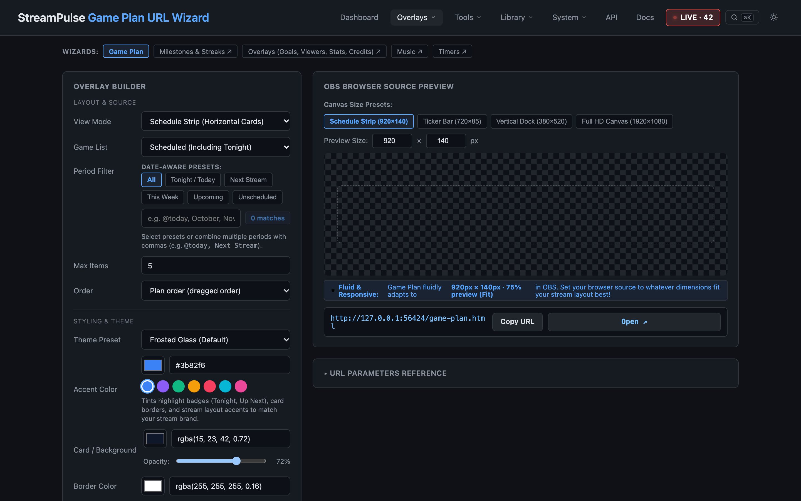

# Overlays, ready for your show

Overlay URL Wizards make it easier to create a focused on-screen display without designing a full scene from scratch. Choose the kind of moment you want to share, customize its look, and preview the result before adding it to your broadcast.

Use a wizard to shape a credits roll, a Game Plan schedule, a timer, a music display, or a milestone card. Each starts with a layout suited to its purpose, so you can spend less time arranging basics and more time making the design feel like your channel.

Wizards complement Custom Overlay Studio: pick a ready-made display when you need one clear element, or build a complete scene when you want more creative control. Your chosen display can be used as an OBS browser source alongside the rest of your scenes.

Browse [StreamPulse features](features.md) or [get started](quickstart.md). Already installed? **Docs** and **API Reference** are available from the app navigation.
