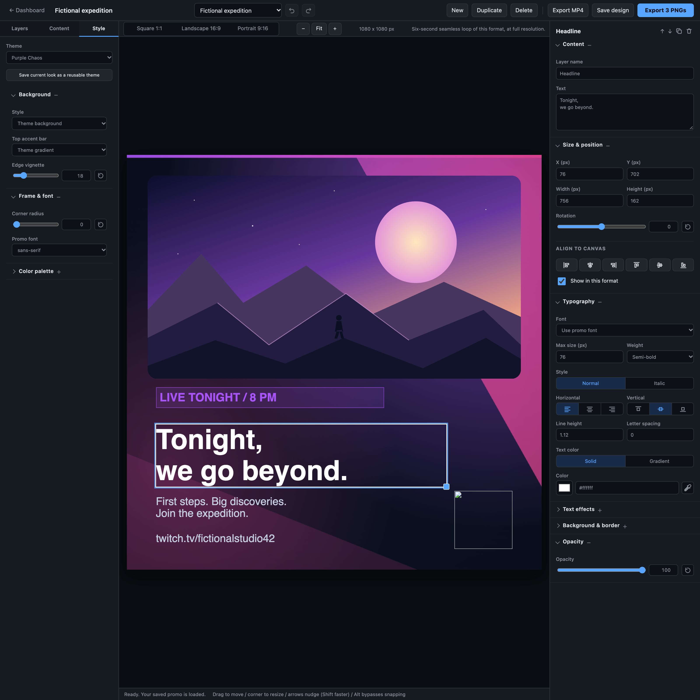

# Create promos for every screen

Promo Creator helps you make a coordinated announcement for a stream, event, or social post without rebuilding the design for each format. Create one composition, then tailor it for square, landscape, and portrait layouts.

Add your headline, supporting text, channel details, and artwork. Adjust the colors and typography to suit your brand, and arrange the pieces until the message feels right. Save a design to revisit it later, export all three formats together as PNGs, or make a short looping MP4 for a moving announcement.

Animated exports make a six-second loop. Keep the tab visible until the download is ready; slower computers may take longer to finish.

It’s a practical way to keep your schedule posts and stream announcements visually consistent while giving each platform the shape it needs. Review images before sharing to ensure they don’t include personal details or private notifications.

See more [StreamPulse features](features.md) or [get started](quickstart.md). Already installed? Find **Docs** and **API Reference** in the app navigation.
